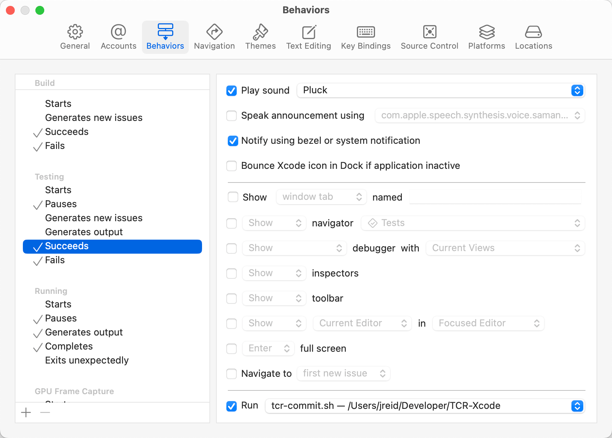
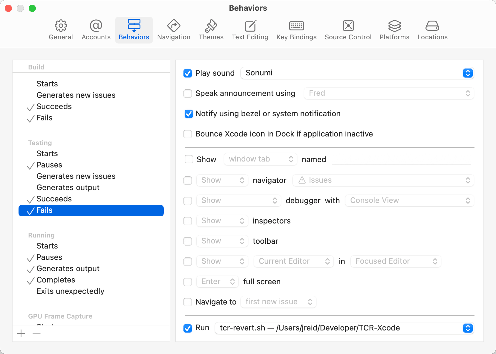

# TCR for Xcode

TCR stands for "test && commit || revert," a challenging and fun development workflow. It goes like this:
- Make some changes.
- Run tests.
- If the tests pass, it commits your changes.
- If the tests fail, it reverts your changes.

**Note:** This works for Xcode projects and workspaces. It currently doesn't work for Swift packages.

<!-- toc -->
<!-- endToc -->

## What It Does

Upon a successful test run, the commit script shows a dialog asking you for a commit message. Enter your commit message and press enter, and it will commit your changes.

Upon a test failure, the revert script will revert your changes. It deletes any new files. (Any files ignored by your repo will remain.) And it shows you a dialog to letting you know it did its business.

## Temporary Bypass

To bypass TCR, deselect the Run script in the Testing Fails behaviors. This will keep any changes in place.

You can keep the Run script in place for Testing Succeeds. If you leave the commit message blank, it won't make a commit.

## TDD Mode

Because the commit and revert scripts are separate, you can choose to use just the commit script.
This turns the setup into a TDD tool: you can write failing tests and explore solutions freely.
Commits only happen when tests pass — but failures don’t revert your work.

## How to Set It Up

Clone this repo. Then in Xcode, open Settings and go to the Behaviors tab.

Under "Testing Succeeds" scroll down until you see a "Run" option. Select the `tcr-commit.sh` script.
If you want it to also push, select `tcr-commit-and-push.sh` instead.

Under "Testing Fails" set the "Run" to the `tcr-revert.sh` script.

## References

- [test && commit || revert](https://medium.com/@kentbeck_7670/test-commit-revert-870bbd756864) original article by Kent Beck

## About the Author

Jon Reid is the author of _[iOS Unit Testing by Example](https://iosunittestingbyexample.com)._  
Find more at [Quality Coding](https://qualitycoding.org).

